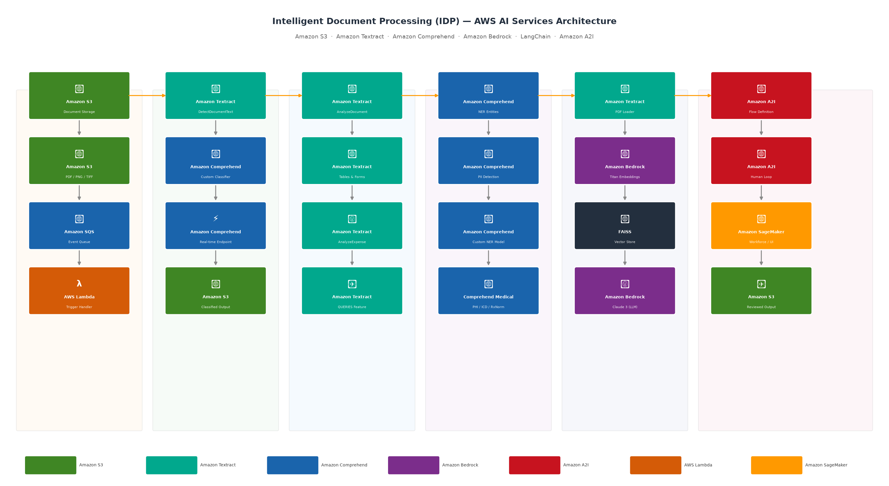

# Intelligent Document Processing (IDP) with AWS AI Services

A comprehensive Python project implementing an end-to-end **Intelligent Document Processing (IDP)** pipeline using AWS AI services, based on the following AWS blog posts:

- [Part 1 – Data Capture, Classification, and Extraction](https://aws.amazon.com/blogs/machine-learning/part-1-intelligent-document-processing-with-aws-ai-services/)
- [Part 2 – Enrichment, Queries, and Human Review (A2I)](https://aws.amazon.com/blogs/machine-learning/part-2-intelligent-document-processing-with-aws-ai-services/)
- [IDP with Amazon Textract, Amazon Bedrock, and LangChain](https://aws.amazon.com/blogs/machine-learning/intelligent-document-processing-with-amazon-textract-amazon-bedrock-and-langchain/)

---

## Architecture Overview



See [`docs/architecture/`](docs/architecture/) for the full architecture diagram and description.

---

## IDP Pipeline Phases

| Phase | Description | AWS Services |
|---|---|---|
| **1. Data Capture** | Ingest documents (PDF, PNG, JPEG, TIFF) into S3 | Amazon S3 |
| **2. Classification** | Categorize documents (invoice, bank statement, receipt, etc.) | Amazon Comprehend Custom Classifier |
| **3. Extraction** | Extract text, tables, forms, key-value pairs, expenses, IDs | Amazon Textract |
| **4. Enrichment** | Named entity recognition, PII redaction, custom entities | Amazon Comprehend, Comprehend Medical |
| **5. Queries** | Answer natural-language questions over document content | Amazon Textract Queries |
| **6. Generative AI Q&A** | RAG-based Q&A over documents using LLMs | Amazon Bedrock + LangChain |
| **7. Human Review** | Human-in-the-loop validation for low-confidence extractions | Amazon A2I |

---

## Project Structure

```
.
├── README.md
├── requirements.txt
├── config/
│   └── config.yaml                  # AWS region, bucket names, model IDs
├── docs/
│   └── architecture/
│       ├── idp_architecture.png     # Architecture diagram (auto-generated)
│       └── architecture.md          # Architecture description
├── src/
│   ├── __init__.py
│   ├── data_capture/
│   │   ├── __init__.py
│   │   └── s3_uploader.py           # Upload documents to S3
│   ├── classification/
│   │   ├── __init__.py
│   │   └── document_classifier.py   # Comprehend custom classifier
│   ├── extraction/
│   │   ├── __init__.py
│   │   ├── textract_extractor.py    # Text, tables, forms, expense, ID
│   │   └── queries_extractor.py     # Textract natural language queries
│   ├── enrichment/
│   │   ├── __init__.py
│   │   ├── entity_recognizer.py     # Comprehend NER + custom entities
│   │   ├── medical_extractor.py     # Comprehend Medical
│   │   └── pii_redactor.py          # PII detection & redaction
│   ├── genai/
│   │   ├── __init__.py
│   │   └── bedrock_langchain_qa.py  # Bedrock + LangChain RAG Q&A
│   ├── human_review/
│   │   ├── __init__.py
│   │   └── a2i_workflow.py          # Amazon A2I human review workflow
│   └── pipeline/
│       ├── __init__.py
│       └── idp_pipeline.py          # Orchestrated end-to-end pipeline
├── notebooks/
│   ├── 01_data_capture.ipynb
│   ├── 02_classification.ipynb
│   ├── 03_extraction.ipynb
│   ├── 04_enrichment_and_queries.ipynb
│   ├── 05_genai_bedrock_langchain.ipynb
│   └── 06_human_review_a2i.ipynb
├── scripts/
│   ├── generate_architecture.py     # Generates the architecture diagram
│   └── run_pipeline.py              # CLI entrypoint for the IDP pipeline
└── tests/
    ├── __init__.py
    ├── test_extraction.py
    ├── test_classification.py
    └── test_enrichment.py
```

---

## Prerequisites

- Python 3.9+
- AWS account with access to:
  - Amazon S3
  - Amazon Textract
  - Amazon Comprehend
  - Amazon Comprehend Medical
  - Amazon Bedrock (Claude / Titan models enabled)
  - Amazon Augmented AI (A2I)
- AWS credentials configured (`aws configure` or IAM role)

---

## Setup

```bash
# Clone the repository
git clone <your-repo-url>
cd intelligent-document-processing

# Create and activate a virtual environment
python -m venv .venv
source .venv/bin/activate        # Linux/Mac
.venv\Scripts\activate           # Windows

# Install dependencies
pip install -r requirements.txt
```

---

## Configuration

Edit `config/config.yaml` to set your AWS region, S3 bucket name, and model ARNs:

```yaml
aws:
  region: us-east-1
  s3_bucket: your-idp-documents-bucket

comprehend:
  classifier_endpoint_arn: ""        # Fill after training
  ner_endpoint_arn: ""               # Fill after training

bedrock:
  model_id: anthropic.claude-3-sonnet-20240229-v1:0
  embedding_model_id: amazon.titan-embed-text-v1

a2i:
  flow_definition_arn: ""            # Fill after creating A2I workflow
```

---

## Quick Start

```bash
# Run the full pipeline on a sample document
python scripts/run_pipeline.py --document path/to/document.pdf --bucket your-s3-bucket

# Generate architecture diagram
python scripts/generate_architecture.py
```

---

## Notebooks

Step-by-step Jupyter notebooks are in the `notebooks/` folder. Run them in order:

1. `01_data_capture.ipynb` — upload sample documents to S3
2. `02_classification.ipynb` — train & run Comprehend custom classifier
3. `03_extraction.ipynb` — Textract text/table/form/expense/ID extraction
4. `04_enrichment_and_queries.ipynb` — NER, PII redaction, Textract queries
5. `05_genai_bedrock_langchain.ipynb` — RAG Q&A with Bedrock + LangChain
6. `06_human_review_a2i.ipynb` — A2I human review workflow

---

## References

- [AWS blog: IDP Part 1](https://aws.amazon.com/blogs/machine-learning/part-1-intelligent-document-processing-with-aws-ai-services/)
- [AWS blog: IDP Part 2](https://aws.amazon.com/blogs/machine-learning/part-2-intelligent-document-processing-with-aws-ai-services/)
- [AWS blog: IDP with Textract, Bedrock & LangChain](https://aws.amazon.com/blogs/machine-learning/intelligent-document-processing-with-amazon-textract-amazon-bedrock-and-langchain/)
- [AWS Samples GitHub – aws-ai-intelligent-document-processing](https://github.com/aws-samples/aws-ai-intelligent-document-processing)

---

## License

MIT License
